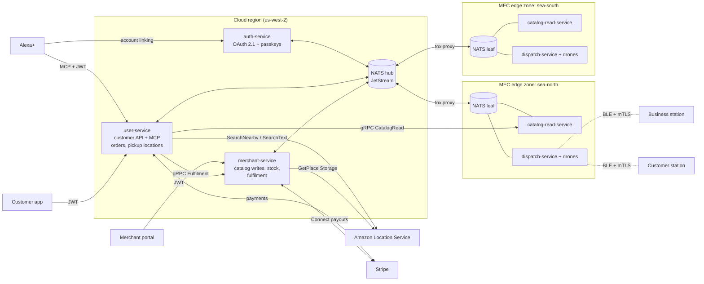

# Drone Drop — Architecture

> **Status:** this describes the planned design (v2, 2026-09-15). auth-service is implemented; the other services are scaffolded (they build, boot and serve `/healthz`; see each service's README). Update this doc as each milestone lands.

## Overview
Drone Drop is a voice-commerce and drone-delivery **simulation** for Alexa+.

1. **Search.** A customer asks Alexa+ for something nearby. Alexa uses our **MCP server** (in user-service), which finds places by category with **Amazon Location SearchNearby** and keeps only those with a Drone Drop catalog.
2. **Conversation.** Alexa reads out each shop's and item's spoken name, builds the cart with the customer, and places the order once the customer confirms by voice.
3. **Acceptance.** The business accepts the order in its portal, and the payment is captured.
4. **Delivery.** A drone in the business's edge zone flies to the pickup station, proves the station's identity over Bluetooth with mutual TLS, collects the order, and does the same at the customer's pickup station.

**Stack:**
- **Services:** Rust (axum, tonic, sqlx/Postgres, rmcp, async-nats).
- **Messaging:** gRPC for calls that need an answer; NATS JetStream for events and commands, including all traffic to and from edge zones. Both use protobuf contracts from [`proto/`](../proto).
- **Maps and places:** Amazon Location Service (Places, Maps) with MapLibre.
- **Local runtime:** Docker Compose, with two simulated MEC edge zones.
- **Simulated city:** Seattle (`us-west-2`), zones `sea-north` and `sea-south`.

## Services
Five services. Each one exists because it owns data or a runtime location that no other service should share.

| Service | Runs | Owns | Why it is a separate service |
|---|---|---|---|
| **auth-service** | Cloud | `auth` database: users, passkeys, sessions, OAuth clients, grants | The only holder of credentials. Every client (the app, Alexa account linking) signs in here, and every other service trusts its JWTs without ever seeing a password. |
| **user-service** | Cloud | `user_service` database: pickup locations, customer stations, orders and order history, payments, spend policy | Everything the customer owns, behind one API. It serves the customer app and the Alexa+ **MCP server**, and owns the order: placement, payment, and the full history. A wallet may be added here later. |
| **merchant-service** | Cloud | `merchant` database: businesses, members, catalog, stock, fulfilment, business stations, Stripe Connect accounts | The **write side** for businesses. Onboarding links a business to its Amazon Location place ID; the merchant edits the catalog and stock, and accepts or rejects orders. Stock reservation and fulfilment share one transaction, so no saga crosses services for stock. |
| **catalog-read-service** | Edge, one per zone | `catalog_read_<zone>` database: denormalized catalogs keyed by place ID | The **read side** of the catalog (CQRS). Read-only, projected from merchant-service events, so product and menu reads are fast, scale out per zone, and keep working while a zone is cut off from the cloud. It takes all catalog load off user-service and merchant-service. |
| **dispatch-service** | Edge, one per zone | `dispatch_<zone>` database: drones, docks, missions, station handshakes | The zone's drone fleet, and nothing else. It assigns drones, runs the flight simulator, and records station handshakes. It lives next to the drones so a network partition doesn't ground them. |

**Not services:** the MEC edge zone is where catalog-read-service and dispatch-service run, not a service of its own. The live customer map is a WebSocket in user-service fed by dispatch events.

## System diagram


**Communication rules:**
- **Public HTTP** only for OAuth and JWKS (auth), the customer API and `/mcp` (user), the merchant portal API (merchant), public catalog reads (catalog-read), and Stripe webhooks.
- **gRPC** for calls that need an answer, on internal ports: user → catalog-read `CatalogRead`, user → merchant `Fulfilment`, user → dispatch `Fleet` (live map), auth `UserDirectory` / `GrantRegistry`.
- **NATS JetStream** for everything that must survive a service or a zone being down: merchant state events, dispatch requests, mission events and telemetry. Edge zones reach the cloud only through their NATS leaf node.
- **Data:** each service owns its database and no service reads another's. See [DATABASE.md](DATABASE.md).

## Key flows

### 1. Alexa account linking
1. Alexa calls user-service `/mcp` without a token and gets `401` with a `WWW-Authenticate` header pointing at the protected-resource metadata.
2. That metadata names auth-service as the authorization server.
3. Alexa runs the authorization code flow with PKCE (S256) and `resource=<user>/mcp`. The user signs in (password + passkey) and consents.
4. auth-service issues a JWT access token (`aud` = the MCP resource, `expires_in` = 3600) and a long-lived refresh token.
5. user-service validates every MCP request against the JWKS: `iss`, `aud`, `exp`, and the `delivery` scope.

### 2. Merchant onboarding → catalog
1. A merchant signs up in auth-service (passkey required for merchant logins).
2. In the portal they search Amazon Location (SearchNearby or SearchText) for their business and claim it: merchant-service calls `GetPlace` with `IntendedUse=Storage`, which Amazon requires before a place ID may be stored. `businesses.place_id` links the place to the merchant account.
3. The merchant sets a **spoken name** for the shop (defaults to the place title) and one for each item, so Alexa+ reads out "Joe's Coffee" and "large oat latte" rather than a legal name or SKU.
4. They build the menu and stock, register the business station (see flow 5), and onboard with Stripe Connect.
5. Every change commits with an outbox row. merchant-service publishes full-state events (`merchant.state.catalog.<place_id>`, `merchant.state.section.<id>`, `merchant.state.item.<id>`) to `MERCHANT_EVENTS`, which is sourced into each zone's JetStream domain. catalog-read-service projects them into its read tables.

### 3. Voice order → payment → dispatch
1. **Find.** The customer asks for coffee. The MCP tool calls **SearchNearby** with the category, near the customer's verified pickup location (`IntendedUse=SingleUse`: results are not stored).
2. **Filter.** It sends the returned place IDs to **catalog-read-service** `BatchGetCatalogsByPlaceIds` in the customer's zone. Only places with a Drone Drop catalog come back, each with its spoken name.
3. **Browse.** `GetMenu(place_id)` returns items with spoken names, prices, weights and availability. Alexa builds the cart.
4. **Price.** user-service calls merchant-service `Fulfilment.PriceOrder` for authoritative prices, weight and stock (read-side data is never trusted for money). Alexa reads back the shop, items, total, pickup location and ETA.
5. **Place.** After an explicit "yes", user-service applies the **spend policy**: an order above the customer's approval threshold waits in `AWAITING_APPROVAL` until the customer approves it in the app with a passkey. Then it authorizes payment, stores the order, and calls `Fulfilment.SubmitOrder`, which reserves stock and puts the order on the business's board.
6. **Accept.** The business accepts (or rejects, or the 5-minute window lapses). merchant-service publishes `merchant.fulfilment.<order_id>.<event>`; user-service captures the payment, or voids it and cancels.
7. **Dispatch.** Once paid, user-service publishes `dispatch.<zone>.request` to the zone that contains the business station, with both stations' positions, access networks and public-key hashes copied in.
8. **Fly.** dispatch-service assigns a drone, which flies to the business station, performs the station handshake, is loaded, then flies to the customer station and hands over. Mission events (`mission.<order_id>.*`) flow back through the hub to user-service (order state, history, live map) and merchant-service (board).

### 4. Adding a pickup location and station (customer)
1. In the app the customer searches an address (Amazon Location Autocomplete/Geocode), then drags the pin to the exact spot. Optionally they stand on the spot and the app records the phone's GPS fix and its reported accuracy. The position, its accuracy and its source are stored.
2. The location is `PENDING` until the customer verifies it with a fresh passkey step-up; only `VERIFIED` locations can receive orders.
3. The customer registers a station for the location (flow 5). Adding a location by voice through Alexa creates it `PENDING`; it must be verified in the app.

### 5. Station handshake at pickup and drop-off
Stations are small devices at a business's pickup pad or a customer's pickup location. A station has a key pair (its public key is registered with the owning service), a position, and one or more **access networks**.

1. **Registration.** The owner registers the station: its public key (DER SubjectPublicKeyInfo, pinned by SHA-256), its access networks in priority order, and receives the zone fleet CA certificate so it can verify drones.
2. **Approach.** The drone flies to the station's stored position (GNSS). Phone GPS is typically good to about 5 m under open sky and worse near buildings, so the position only has to bring the drone within radio range.
3. **Discover.** Within about 50 m the drone scans the station's access networks in order. **Bluetooth LE** (first implementation): match advertisements by the platform service UUID and the station's `station_tag`. MAC addresses are not used, because BLE devices rotate them.
4. **Connect.** Open an L2CAP connection-oriented channel, which gives a byte stream.
5. **Authenticate.** TLS 1.3 with mutual authentication over that stream. The drone accepts the station only if its key matches the `public_key_sha256` in the mission; the station accepts the drone only if its certificate chains to the zone fleet CA.
6. **Confirm.** The drone sends the mission id and a nonce; the station answers `loaded` (pickup) or `received` (drop-off).
7. **Record.** dispatch-service stores the attempt in `station_handshakes` (result, access network, ranging method, distance) and publishes `mission.<order_id>.station_verified` or `station_failed`.

**Extensible by design:** `crates/station` defines an `AccessNetwork` trait (`scan`, `connect` → async byte stream). Bluetooth LE implements it first; Wi-Fi (join the network, then TLS over TCP; WPA3-Enterprise EAP-TLS can also authenticate the join itself) or UWB can be added as new implementations and new `AccessNetwork` cases in `station.proto`, without changing the handshake. `ranging_method` is recorded so finer ranging (Bluetooth 6.0 Channel Sounding, UWB) can refine landing later.

### 6. Edge partition and recovery (MEC demo)
1. `scripts/partition-edge.sh sea-north` cuts the zone's uplink through toxiproxy.
2. The zone keeps running: catalog-read-service keeps answering from its projections, and dispatch-service keeps flying and delivering. Mission events and telemetry buffer in the zone's JetStream domain; new dispatch requests and catalog events queue on the hub.
3. `scripts/heal-edge.sh sea-north` restores the link.
4. Buffered events sync in both directions: projections catch up and orders and the live map catch up.

## CQRS: catalog writes and reads
- **Commands** go only to merchant-service, which validates them against its normalized tables and commits each change together with an outbox row.
- **Events carry state.** Each event holds the full current state of one aggregate (a catalog, a section or an item) on its own subject. `MERCHANT_EVENTS` keeps the latest message per subject, so a new or rebuilt zone replays the current state of every catalog without the full history.
- **Queries** go only to catalog-read-service. Each read table matches one query shape, keyed by place ID; reads never join across tables at query time.
- **Consistency:** reads are eventually consistent (normally well under a second; lag is reported on `/healthz`). Anything involving money or stock is re-checked on the write side (`Fulfilment.PriceOrder`, `SubmitOrder`).
- **Scaling:** add catalog-read-service replicas or zones without touching merchant-service.

## State machines
**Order** (user-service):
```
AWAITING_APPROVAL (only above the approval threshold) → AUTHORIZING → AWAITING_MERCHANT → CAPTURING → PAID
  → DISPATCH_REQUESTED → DRONE_ASSIGNED → AT_PICKUP → PICKED_UP → DELIVERED → COMPLETED

approval declined or expired ......................... → CANCELLED
declined payment ...................................... → PAYMENT_FAILED
merchant rejects / 5-min timeout (authorization voided)  → CANCELLED
after PAID: no drone / station failed / aborted / cancelled before pickup → REFUNDED
```
**Fulfilment** (merchant-service): `AWAITING_DECISION → ACCEPTED → LOADED`, or `REJECTED`, `EXPIRED`, `CANCELLED`.

**Mission** (dispatch-service): `REQUESTED → ASSIGNED → AT_PICKUP → PICKED_UP → AT_DROPOFF → DELIVERED`, or `STATION_FAILED`, `ABORTED`, `NO_DRONE`, `RECALLED`.

## Contracts
All contracts are protobuf, in [`proto/`](../proto), generated into Rust by [`crates/contracts`](../crates/contracts). Conventions are at the top of [`common.proto`](../proto/dronedrop/common/v1/common.proto). Each RPC's comment lists its allowed callers and error reasons.

### gRPC services
| Owner (package) | Services | Called by |
|---|---|---|
| auth-service (`dronedrop.auth.v1`) | `UserDirectory`, `GrantRegistry` | user, merchant |
| merchant-service (`dronedrop.merchant.v1`) | `Fulfilment` (`PriceOrder`, `SubmitOrder`, `CancelOrder`) | user |
| catalog-read-service (`dronedrop.catalog.v1`) | `CatalogRead` (`BatchGetCatalogsByPlaceIds`, `GetCatalog`, `GetMenu`, `BatchGetItems`) | user |
| dispatch-service (`dronedrop.dispatch.v1`) | `Fleet` (`GetFleetSnapshot`, `GetMission`) | user |

Shared message packages: `dronedrop.station.v1` (stations and access networks), `dronedrop.user.v1` (order states), `dronedrop.events.v1` (event payloads).

### NATS subjects
| Kind | Subjects | Payload | Flow |
|---|---|---|---|
| State events (stream `MERCHANT_EVENTS`, latest per subject) | `merchant.state.catalog.<place_id>`, `merchant.state.section.<section_id>`, `merchant.state.item.<item_id>` | `CatalogState`, `CatalogSectionState`, `CatalogItemState` | merchant → catalog-read (all zones) |
| Events (stream `MERCHANT_EVENTS`) | `merchant.fulfilment.<order_id>.<event>` | `FulfilmentEvent` | merchant → user |
| Commands (stream `DISPATCH_REQUESTS`, work queue) | `dispatch.<zone>.request`, `dispatch.<zone>.recall` | `DispatchRequest`, `RecallMission` | user → dispatch (that zone) |
| Events (stream `MISSIONS`, sourced from zones) | `mission.<order_id>.<event>` | `MissionEvent` | dispatch → user, merchant |
| Telemetry | `tlm.raw.<zone>.<drone>` (10 Hz, stays in the zone); stream `TELEMETRY` (1 Hz, synced to the hub) | `Telemetry` | dispatch → user (live map) |
| Events (stream `AUTH_EVENTS`) | `auth.events.{grant_revoked,user_deleted}` | `GrantRevoked`, `UserDeleted` | auth → all |

## Security model
- **Tokens:** ES256 JWTs, each with exactly one audience (the user API, the MCP resource, or the merchant API). Every service validates its own audience and never forwards tokens. Revoking a grant publishes `auth.events.grant_revoked`.
- **MFA:** passkeys only. Required at every merchant login, to verify a pickup location, and to approve an order above the approval threshold.
- **Voice spending (spend policy):**
  - The MCP server can never add funds or change limits; only the app can.
  - Orders above the customer's approval threshold need approval in the app (passkey step-up) before payment is authorized.
  - Orders need a verified pickup location, an explicit spoken confirmation, and prices re-checked by merchant-service.
- **Payments:** payment authorizations use the order id as the idempotency key; only a signed provider webhook can mark an order `PAID`. Card details are entered only with the payment provider, never through Alexa or our services.
- **Wallet (future):** user-service may later hold a wallet the MCP server spends from. The spend policy above already applies to it; the wallet itself is not designed yet.
- **Stations:** drones pin each station's public key from the mission; stations verify drones against the zone fleet CA. A spoofed advertisement or a copied `station_tag` fails the TLS handshake.
- **Service isolation:** each service has its own database and role; gRPC listens on internal ports only; edge services reach the cloud only over their NATS leaf node. Planned: one NATS account per service, and mTLS between services.
- **Place data:** place IDs are stored only after `GetPlace` with `IntendedUse=Storage` during onboarding; SearchNearby results in the MCP flow are used once and not stored.

## Local quick start (planned)
**Prerequisites:**
- Docker Desktop with WSL integration enabled.
- AWS credentials for Amazon Location Places in `us-west-2`, plus an Amazon Location Maps API key.
- A Stripe sandbox with Connect.
- Step-by-step setup: [EXTERNAL_CLOUD_SERVICES_SETUP.md](../EXTERNAL_CLOUD_SERVICES_SETUP.md).

```bash
cp .env.example .env                 # fill AWS, Stripe, Maps key, public URLs
docker compose up --build            # Postgres, NATS hub + 2 leaves, toxiproxy, all services, both zones
npx @modelcontextprotocol/inspector  # connect to http://localhost:8085/mcp
```
For Alexa+, expose user-service through a named cloudflared tunnel, then run `alexa-ai configure-account-linking` and `alexa-ai deploy`.

## References
- GPS accuracy: [GPS.gov](https://www.gps.gov/gps-accuracy)
- Amazon Location place storage (`IntendedUse`): [AWS docs](https://docs.aws.amazon.com/location/latest/developerguide/places-intended-use.html)
- BLE L2CAP connection-oriented channels: [Silicon Labs](https://docs.silabs.com/bluetooth/latest/bluetooth-stack-api/sl-bt-l2cap)
- BLE address rotation and advertising privacy: [Nordic Developer Academy](https://academy.nordicsemi.com/courses/bluetooth-low-energy-fundamentals/lessons/lesson-2-bluetooth-le-advertising/topic/blefund-lesson-2-exercise-3/), [Hubble](https://hubble.com/community/guides/why-ble-advertising-privacy-matters-and-how-ephemeral-device-ids-protect-your-fleet/)
- Bluetooth Channel Sounding: [Bluetooth SIG](https://www.bluetooth.com/learn-about-bluetooth/feature-enhancements/channel-sounding/)
- WPA3-Enterprise EAP-TLS: [SecureW2](https://securew2.com/blog/eap-method-requirements-for-wpa3-enterprise)
