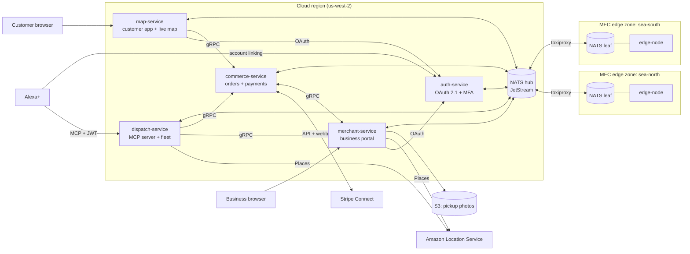

# Drone Drop — Architecture

> **Status:** this describes the planned design. The services are scaffolded (they build, boot and serve `/healthz`; see each service's README), but no features are implemented yet. Update this doc as each milestone lands.

## Overview
Drone Drop is a voice-commerce and drone-delivery **simulation** for Alexa+.

1. **Search.** A customer asks Alexa+ for something nearby. Alexa uses our **MCP server** to find registered shops through **Amazon Location Service** and read their menus.
2. **Conversation.** Alexa and the customer go back and forth until the customer confirms the order by voice. At that point the payment is **authorized**, but not yet charged.
3. **Acceptance.** The business accepts the order, and the payment is **captured** through **Stripe Connect**. The business is paid through the platform.
4. **Delivery.** Only after payment succeeds is a drone dispatched. It is simulated on **MEC edge nodes**, which also read the business's pickup marker. Customers watch the drone on a live map.

**Stack:**
- **Services:** Rust (axum, tonic, sqlx/Postgres, rmcp, async-nats).
- **Messaging:** gRPC between services; NATS JetStream for events, commands and edge traffic. Both use protobuf contracts from [`proto/`](../proto).
- **Maps:** MapLibre GL JS with Amazon Location Maps.
- **Local runtime:** Docker Compose.
- **Simulated city:** Seattle (`us-west-2`).

## System diagram


## Services
| Service | Owns (own Postgres DB) | Does |
|---|---|---|
| **auth-service** | users, MFA (TOTP, passkeys), OAuth clients, refresh tokens | OAuth 2.1 authorization server: ES256 JWT access tokens + JWKS; MFA and step-up authentication |
| **dispatch-service** | missions | **MCP server** for Alexa (shop search, menus, cart, order); drone dispatch to edge zones |
| **merchant-service** | businesses, menus, stock, pickup points | Business registration and portal; place claiming; pickup QR marker + photo verification; accept/reject orders; notifications |
| **commerce-service** | customers, delivery locations, quotes, orders, payments | Order saga; Stripe Connect payments and payouts; order history; spending limits |
| **map-service** | web sessions | Customer web app: live drone map, order history, delivery locations (MFA), payment method setup |
| **edge-node** (one per zone) | local JetStream KV | 10 Hz flight simulation, pickup marker vision, separation and no-fly checks, zone handoff |

**Communication rules:**
- **Public HTTP** only for OAuth, JWKS, MCP, browser pages, Stripe/AWS APIs and Stripe webhooks.
- **gRPC** (tonic) for service-to-service calls that need an answer. It runs on internal ports that are never exposed through the tunnel.
- **NATS JetStream** for events and commands that must survive a service or edge zone being down: order and mission events, the `dispatch.request` work queue, edge commands and telemetry. Payloads are protobuf messages from the same `.proto` files.
- **Data:** each service owns its own Postgres database, and no service reads another's. See [DATABASE.md](DATABASE.md) for the schemas and how services refer to each other's data.

## Key flows

### 1. Alexa account linking
1. Alexa calls `/mcp` without a token. dispatch-service returns 401 with a `WWW-Authenticate` header pointing at its protected-resource metadata.
2. That metadata lists auth-service as the authorization server.
3. Alexa runs the authorization code flow with PKCE (S256) and `resource=<dispatch>/mcp`. The user logs in and consents.
4. auth-service issues:
   - a JWT access token (`aud` = the MCP resource, `expires_in` = 3600)
   - a long-lived refresh token
5. dispatch-service validates every request against JWKS, checking `iss`, `aud`, `exp` and scope.

### 2. Voice order → payment → acceptance → dispatch
1. **Search.** The customer asks for coffee. Alexa calls `search_nearby_shops`: Amazon Places SearchNearby results are joined with registered merchants.
2. **Browse.** Alexa calls `get_shop_details` and `get_menu`, then `update_cart` as many times as needed. Each call returns a quote valid for 10 minutes, with stock reserved.
3. **Confirm.** Alexa reads back the shop, items, total, drop-off location and ETA, and the customer says yes.
4. **Place.** Alexa calls `place_order(quote_id, expected_total_cents)`. commerce-service checks:
   - the quote belongs to this user and is still valid
   - the total matches
   - the delivery location is verified
   - spending caps allow it

   Then it creates a Stripe PaymentIntent with manual capture and a destination charge to the business. The `quote_id` is the idempotency key.
5. **Authorized.** Stripe's webhook confirms the authorization. The order moves to `AWAITING_MERCHANT`, and the business is notified (portal board + email).
6. **Accept or void.**
   - The business **accepts**, and commerce captures the payment.
   - If the business rejects or doesn't respond within 5 minutes, the authorization is voided and no drone is sent.
7. **Paid.** Stripe's `payment_intent.succeeded` webhook moves the order to `PAID`. **Only this state publishes `dispatch.request`.**
8. **Fly.** dispatch-service assigns the edge zone that owns the pickup point. The edge-node flies the drone to the pickup, reads the QR marker to get a visual lock, loads, and delivers.
9. **Watch.** Mission events update the order and the customer's live map.

### 3. Adding a new delivery location (MFA)
1. The customer says "deliver to my office at …". Alexa calls `request_new_delivery_location`, which geocodes the address and creates it as **pending**.
2. Alexa tells the customer to verify it in the Drone Drop app.
3. In map-service, the customer opens the pending location.
4. map-service redirects to auth-service with `acr_values=mfa&max_age=300`, and the customer completes a passkey or TOTP check.
5. The fresh token shows MFA (`amr`, `auth_time`), so commerce-service marks the location **verified**. From then on, voice orders can deliver there.

### 4. Edge partition and recovery (MEC demo)
1. `scripts/partition-edge.sh sea-north` cuts the zone's uplink through toxiproxy.
2. The zone keeps running on its own: its drones keep flying and delivering, while telemetry and mission events buffer in its JetStream domain. New commands for that zone queue on the hub.
3. `scripts/heal-edge.sh sea-north` restores the link.
4. The buffered events sync to the hub, and orders and the map catch up.

## Order state machine
```
CART → QUOTED → AUTHORIZING → AWAITING_MERCHANT → CAPTURING → PAID
     → DISPATCH_REQUESTED → DRONE_ASSIGNED → AT_PICKUP → PICKED_UP → DELIVERED → COMPLETED

declined card ............................................ → PAYMENT_FAILED
merchant rejects / 5-min timeout (authorization voided) ... → CANCELLED
after PAID: no drone / pickup failed / aborted / cancelled  → REFUNDED
```

## Contracts
All contracts are protobuf, in [`proto/`](../proto), and generated into Rust by [`crates/contracts`](../crates/contracts). The conventions are at the top of [`common.proto`](../proto/dronedrop/common/v1/common.proto). Each RPC's comment lists its allowed callers and error reasons.

### gRPC services
| Owner (package) | Services | Called by |
|---|---|---|
| auth-service (`dronedrop.auth.v1`) | `UserDirectory`, `GrantRegistry` | merchant, commerce; dispatch, merchant, map |
| merchant-service (`dronedrop.merchant.v1`) | `ShopCatalog`, `Stock`, `PickupPoints` | dispatch, commerce, map |
| commerce-service (`dronedrop.commerce.v1`) | `Checkout`, `Orders`, `DeliveryLocations`, `CustomerPayments`, `MerchantOrders` | dispatch, map, merchant |
| dispatch-service (`dronedrop.dispatch.v1`) | `Fleet` | commerce, merchant, map |

map-service and edge-node serve no gRPC. Merchant accept/reject calls `MerchantOrders`, and "Loaded onto drone" calls `Fleet.ConfirmLoaded`.

### NATS subjects (summary)
| Kind | Subjects | Payload | Flow |
|---|---|---|---|
| Events (stream `ORDERS`) | `order.<id>.{authorized,accepted,paid,dispatched,picked_up,delivered,payment_failed,cancelled,refunded}` | `OrderEvent` | commerce → merchant, map |
| Command (work queue `DISPATCH_REQUESTS`) | `dispatch.request` | `DispatchRequest` | commerce → dispatch, only when PAID |
| Commands | `cmd.edge.<zone>.{assign,recall,handoff,loaded}` | `EdgeCommand` | dispatch → edge |
| Events (stream `MISSIONS`) | `mission.<order>.{assigned,at_pickup,visual_lock,pickup_failed,picked_up,delivered,aborted,no_drone}` | `MissionEvent` | edge, dispatch → commerce, map |
| Telemetry | `tlm.raw.<zone>.<drone>` (10 Hz, stays at the edge); stream `TELEMETRY` (1 Hz, synced to the hub) | `Telemetry` | edge → dispatch, map |
| Metrics | `metrics.edge.<zone>` | `EdgeMetrics` | edge → map |
| Events (stream `AUTH_EVENTS`) | `auth.events.{grant_revoked,user_deleted}` | `GrantRevoked`, `UserDeleted` | auth → all |
| Events (stream `MERCHANT_EVENTS`) | `merchant.business.<id>.status_changed`, `merchant.pickup_point.verified` | `BusinessStatusChanged`, `PickupPointVerified` | merchant → commerce, edge |
| Events (stream `COMMERCE_EVENTS`) | `commerce.merchant_account.<business_id>.updated` | `MerchantAccountUpdated` | commerce → merchant |
| KV / object store | `ORDER_VIEW`, `PICKUP_ASSETS` (mirrored to edges) | | commerce → map; merchant → edge |

## Security model
- **Tokens:**
  - JWTs are ES256 only, and each carries an audience for exactly one resource. Every service validates its own audience, and no service passes tokens on to another.
  - Revoking a grant publishes `auth.events.grant_revoked`, and services reject that grant immediately.
- **MFA:** passkeys or TOTP. It is required at every login for merchant accounts, and as a fresh step-up check when adding a delivery location.
- **Voice payments** are allowed only when:
  - the delivery location is verified
  - the quote is bound to this user and still valid, and the total matches
  - spending caps allow it (set per order and per day in the app)
  - the business has accepted before capture

  Stripe idempotency prevents double charges.
- **Payment trust:** only a Stripe webhook with a valid signature can mark an order `PAID`. Webhook events are stored and duplicates ignored.
- **Cards:** card details are entered only on Stripe Checkout, never through Alexa or our services.
- **Service isolation:**
  - Each service has its own database and role, and cannot connect to another service's database.
  - Each service has a NATS account limited to its own subjects.
  - gRPC listens on internal ports only.
  - Planned: mTLS between services, with each RPC accepting only the callers listed in its `.proto` comment.
- **Pickup markers:** QR payloads are HMAC-signed (`ddp:v1:<pickup_id>:<hmac>`). The edge verifies the signature before landing.

## Local quick start (planned)
**Prerequisites:**
- Docker Desktop with WSL integration enabled
- AWS credentials for Places and S3 in `us-west-2`, plus an Amazon Location Maps API key
- Stripe test account with Connect, and the Stripe CLI

**Steps:**
```bash
cp .env.example .env                 # fill AWS, Stripe, Maps key, public URLs
docker compose up --build            # Postgres, NATS hub + 2 leaves, toxiproxy, MinIO, Mailpit, all services
stripe listen --forward-to localhost:8084/webhooks/stripe
scripts/seed-merchants.sh            # registers demo Seattle shops with menus + pickup markers
npx @modelcontextprotocol/inspector  # connect to http://localhost:8082/mcp
```
- For Alexa+, expose the stack through a named cloudflared tunnel, then run `alexa-ai configure-account-linking` and `alexa-ai deploy`.
- The full implementation plan and milestones are tracked outside the repo.
